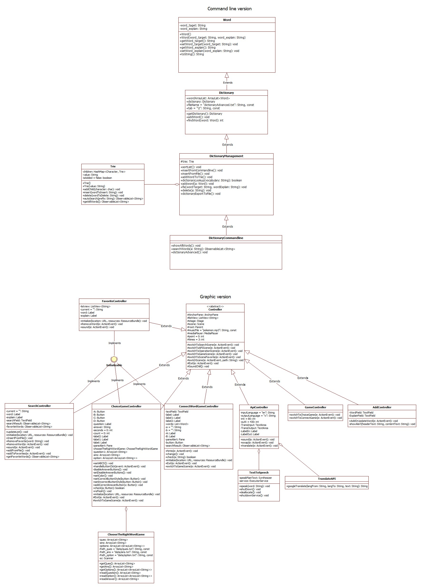
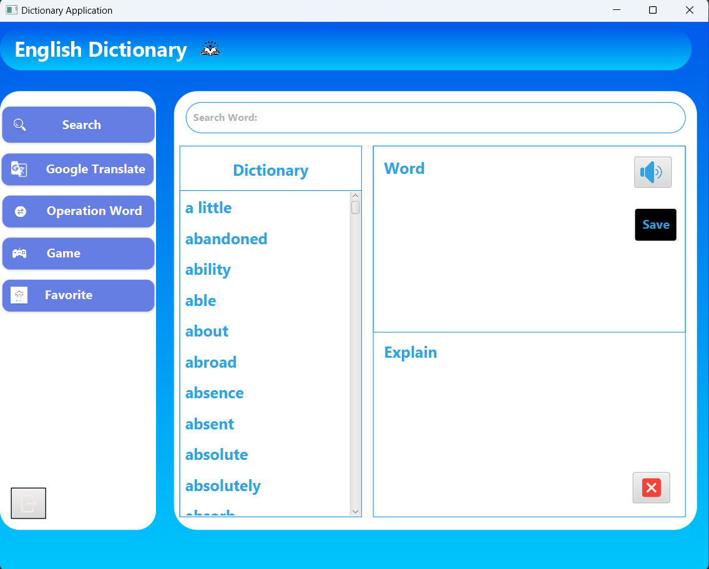
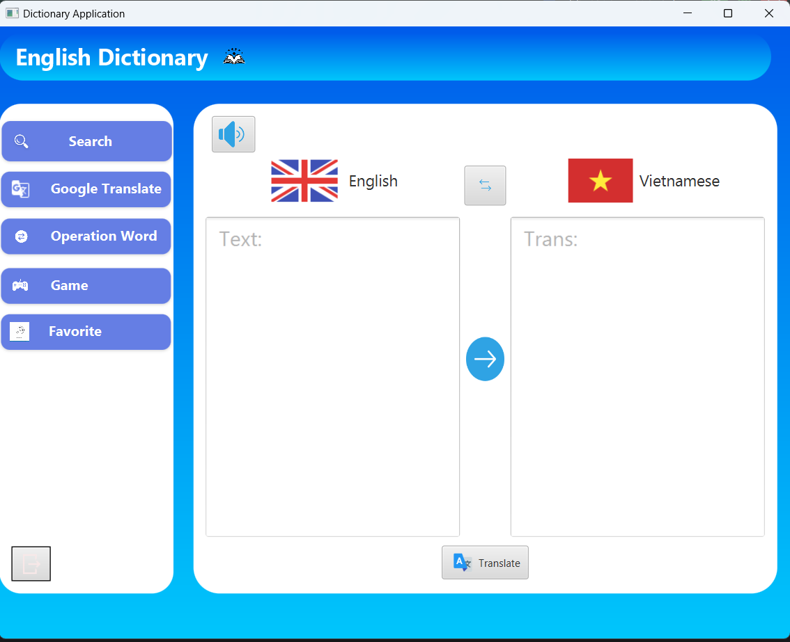
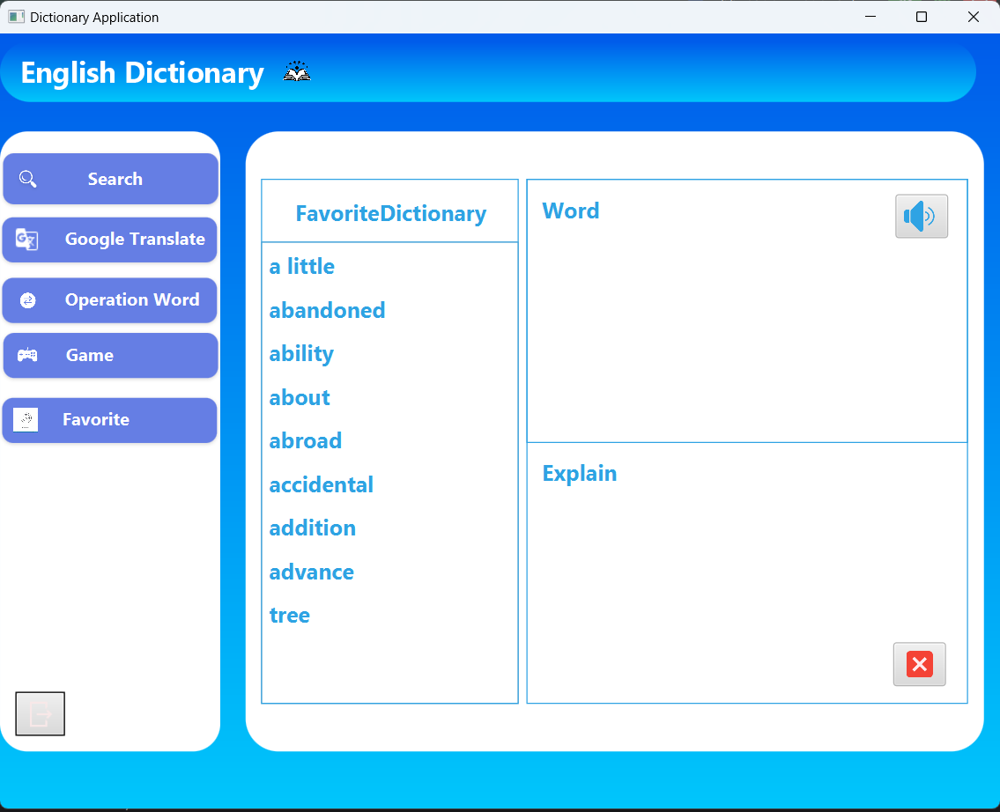
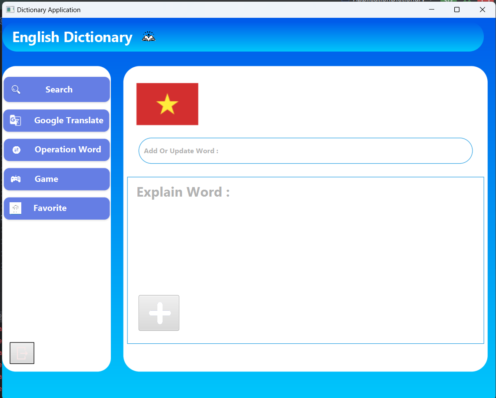
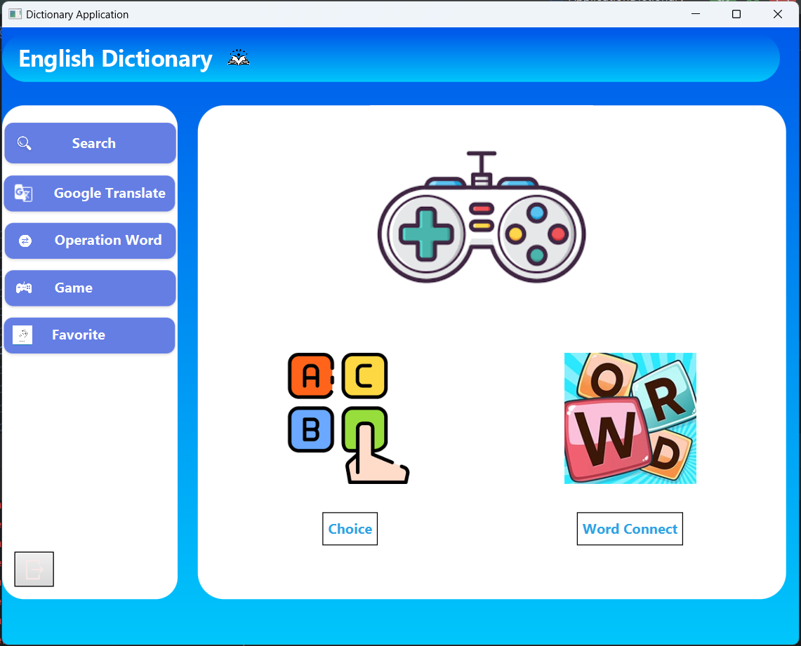

# Application to support learning English using Java

## Author
Group HKL
1. Nguyen Van Huy - 23020379
2. Tran Quoc Khanh - 23020387
3. Nguyen Van Linh - 23020395

## Description
The application is designed to support learning English. The application is written in Java and uses the JavaFX library. The application is based on the MVC model. The application has dictionaries: English-Vietnamese. The application use dictionaryAdvanced.txt files to store data.
1. The application is designed to support learning English.
2. The application is written in Java and uses the JavaFX library.
3. The application is based on the MVC model.
4. The application has dictionaries: English-Vietnamese.
5. The application use dictionaryAdvanced.txt files to store data.

## UML diagram

## Installation
1. Clone the project from the repository.
2. Open the project in the IDE.
3. Setup jdk and add libraries 
3. Run the project.
4. If you want to change the data, you can change the dictionaryAdvanced.txt.

## Usage
1. Search for a word in the dictionary and type word, then the right side of the window will display the meaning of the word.
2. To add a new word, click the Operation Word (swap icon).
3. To delete a word, click the Delete button (Delete icon).
4. To save the changes, click the Operation Word (Plus icon).
5. save words to favorites,click the favorites button ( favorites icon)
6. API of Google Translate to translate,click the Translate button ( Translate icon)
7. To pronounce the word, click the Pronounce button (Speaker icon).
8. To practice, click the Practice button (Play icon), then the application will display a Game window, choose the game you want to play : ChoiceGame
   + In the Game window, click the Start button to start the game.
   + The application will display a word that is removed some letters, you need to enter the missing letters in the text box and click the Check button to check the answer.
   + If the answer is correct, the application will display a new word and increase the score by 100.
   + If the answer is incorrect, the application will display a new word and decrease the times by 1.
   + To exit the game, click the Exit button (Exit icon).
   + To reset the game, click the Reset button.
9. To practice, click the Practice button (Play icon), then the application will display a Game window, choose the game you want to play : ConnectGame
   + In the Game window, click the Word Connect button to start the game
   + The program will display the first letter of the word you need to enter the word starting with that letter.
   + If the answer is correct, the application will display a new word and increase the score by 100.
   + If the answer is incorrect, the application will display a new word and decrease the times by 1.
   + If you want to use the hint, you will lose the score by 200.
   + To exit the game, click the Exit button (Exit icon).
   + To reset the game, click the Reset button.
10. To exit the application, click the Exit button (Exit icon).

## Demo
+ search

+ Google Translate

+ favorite

+ Operation Word 

+ Game

## Future improvements
1. Add more dictionaries.
2. Add more complex games.
3. Optimize the word lookup algorithm.
4. Use a database to store data.
5. Integrate the application with API of Google Translate to translate paragraphs and whole documents.
6. Integrate the application with API of Google Speech to Text to convert speech to text.
7. Improve the user interface.

## Contributing
Pull requests are welcome. For major changes, please open an issue first to discuss what you would like to change.

## Project status
The project is completed.

## Notes
The application is written for educational purposes.

